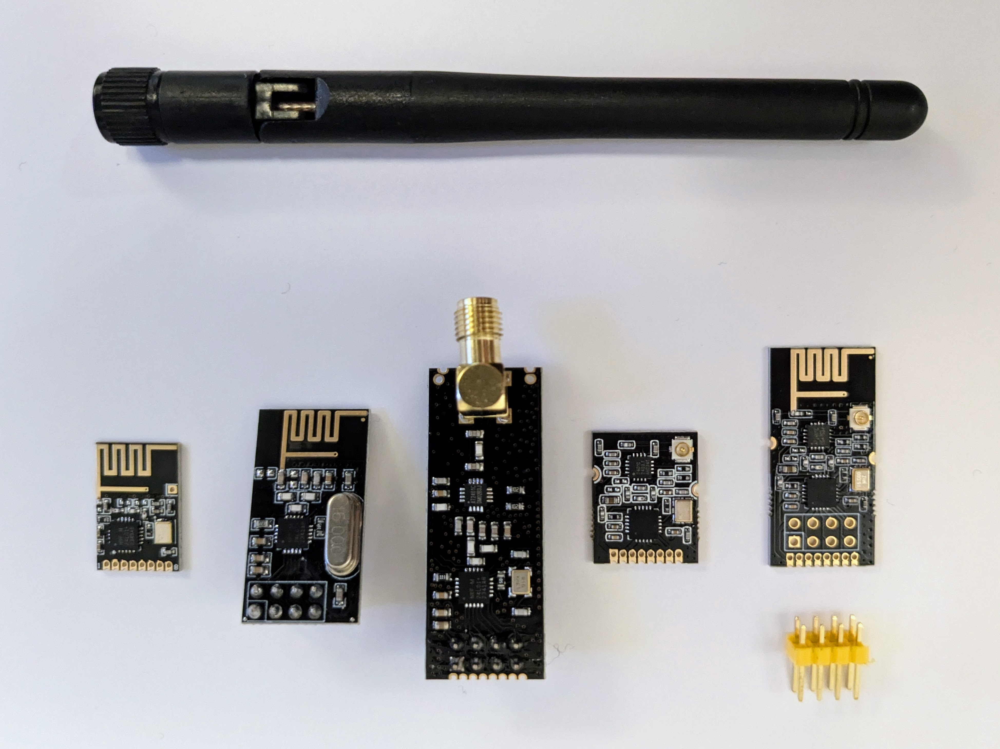

Cheap US$10 2.4Ghz band spectrum analyzer
=========================================

First off, the cheapest readily available device, that I found, that can handle the 2.4GHz band and that can credibly be called a spectrum analyzer is the [tinySA Ultra](https://www.tinysa.org/wiki/) at around US$120 (plus US$15 shipping).

The DIY setup described below may not really be a spectrum analyzer but it can help find the clearest part of the 2.4GHz band - a task for which one would normally otherwise need a spectrum analyzer.


Note: the display looks very blurry in the photo above, this is just an issue with my photography - the OLED display is very crisp in reality.

The parts list below, including shipping, come to around US$10.

While I came up with the particular hardware selection below, most of the credit should go to [2bndy](https://github.com/2bndy5) who wrote the [`scannerGraphic.ino`](https://github.com/nRF24/RF24/commits/master/examples/scannerGraphic/scannerGraphic.ino) example that's part of the Arduino [RF24 library](https://github.com/nRF24/RF24).

Parts:

* [nRF24L01+ DIP module](https://www.aliexpress.com/item/32330779943.html)
* [RP2040-Zero](https://www.aliexpress.com/item/1005004967926448.html) (buy the one with the header already soldered to save yourself time later).
* [128x64 1.3" white OLED module](https://www.aliexpress.com/item/1005003484018034.html)
* [3.3V voltage regulator](https://www.aliexpress.com/item/32464952488.html)
* [4x6cm protoboard](https://www.aliexpress.com/item/32864559799.html)

If you don't already have additional header, the same store, has [1x40 pin header](https://www.aliexpress.com/item/32402348546.html).

I sometimes want to use this setup on-the-go. If you already have a powerbank, this is the obvious easy solution for powering things in this situation. An alternative is to plug together a USB OTG setup and power it from your smartphone. For this, you'll need:

* A regular [USB-A to USB-C cable](https://www.aliexpress.com/item/1005005274790443.html)
* A [USB-A female to USB-C male OTG adapter](https://www.aliexpress.com/item/32830129548.html) (this page lists different variants, the cheap "USB2.0 TypeC to USB" one is fine).

It feels odd that such a cable combination costs almost as much as the total for all the other parts.

Note: instead of USB-A to USB-C cable plus an OTG adapter you can apparently use a USB C2C cable (see the RP2040-Zero [FAQ](https://www.waveshare.com/wiki/RP2040-Zero#FAQ)) but currently it's not particularly easy to find cables that are clearly labelled as supporting C2C.

TODO:

* Is the SMD module more convenient than the DIP one.
* Was 4x6cm protoboard the best size?

Notes:

* Many AliExpress product pages use the odd term "welding" to mean a board that comes with header already soldered on.
* Many tutorials recommend only using NRF24L01+ modules with a FEM (Front End Module) or PA (Power Amplifier) - these allow the module to transmit further but as this setup only involves listening, i.e. receiving, a FEM/PA isn't necessary.
* One could power the NRF24L01+ module directly from the 3.3V pin of the RP2040-Zero but the NRF24L01+ module is very sensitive to noise and the small volatage regulator board includes a capacitor arrangement that others have found works well at making things less noisy. If you prefer, you could just solder in a suitable capacitor, on its own, instead.

The display used here comes in two variants - an I2C one and an SPI one. The I2C variant is easier to wire up (requiring four wires rather than the seven needed for the SPI one). I2C is slower than SPI but for this setup the speed difference shouldn't really matter. However, I went with the SPI one as I just came across far more issues around OLEDs using I2C than SPI when looking into which to use.

As far as I understand it one wants you want to be able to look at the unmodulated RF noise floor across the 2.4Ghz band. All kinds of devices, including micro-wave ovens and Wi-Fi routers, are pumping out RF energy at various frequencies in this band and one wants to find the area in the band with the least such energy, i.e. the clearest part of the band.

Note: I don't really know very much about RF - I'd appreciate being corrected if anything I just said isn't quite right.

I'd be curious to know if others think they can do better than this solution while still staying well below e.g. US$50 for parts.

An obvious first upgrade would be to use a larger 320x240 screen like the 2" and 2.8" models available [here](https://www.aliexpress.com/item/1005003797803015.html) (other product pages on AliExpress, with the same 2" model, describe it as an OLED but I don't see anything on the silkscreen to confirm this).

The sketch has nice features, e.g. the max values seen across the spectrum are decayed over time so, the impact of intermittent events isn't immediately lost.

nRF24 modules
-------------

nRF24 modules come in various forms:



The two on the left have just one chip, the nRF24 chip itself, while the three on the left have an additional PA+LNA chip.

The module second from the left is probably the most popular nRF24 module. However, it's lack of a PA+LNA chip means it has very limited range. The left-most module is just a newer variant of this with an SMD oscillator rather than the large thru hole one of the original version. Both of these modules have a PCB antenna.

A PA+LNA chip has a power amplifier (PA) that increases the transmitting power and low noise amplifier (LNA) that improves receiving sensitivity and together they substantially increase the range of such modules.

The PA+LNA chip is typically a [Skyworks Solutions RFX2401C](https://www.lcsc.com/product-detail/RF-Transceiver-ICs_Skyworks-Solutions_RFX2401C_Skyworks-Solutions-RFX2401C_C19213.html) or its Chinese clone, the [Zhongkewei AT2401C](https://www.lcsc.com/product-detail/RF-Front-End-Circuits_ZHONGKEWEI-AT2401C_C783588.html).

The module in the middle with the screw-on whip antenna is the most popular nRF24 module that comes with a PA+LNA chip.

The module to its right is a more compact version with a u.FL connector for an external antenna.

And the right-most module is similar but, as well as the u.FL connector, it has a PCB antenna.

Note that the left-most module and the one second from the right only have castellated 1 mm pitch holes which are great if you're planning a production run where a [pick-and-place machine](https://en.wikipedia.org/wiki/Pick-and-place_machine) will do the hard work. But for hobbyist use, they're hard to work with and should be avoided in favor of the ones with the more normal 2.54 mm pitch holes.

Initially, I thought a module without a PA+LNA chip might be OK for this project (there's no transmitting involved so, the PA part adds nothing). I tried the module second from the left but found it nearly useless - it detected no noise unless it was right next to a noise source.

So, then I tried the middle module and the left-most module and found that for this project there was little noticeable difference between the two. The large screw-on whip antenna didn't seem better than the other module's PCB antenna for this particular purpose. So, in the end, I went with the more compact of the two.

Breadboard
----------


As well as the breadboard layout of the various parts, the diagram above also includes larger views of the pinouts for the RP2040-Zero, OLED module and nRF module in order to make the SPI pins involved clearer.

**Warning:** different SPI OLED modules will have the same set of seven pins but there's no consistency in the order of these pins - I've shown the pinouts for both the [Waveshare 1.3" OLED (variant B)](https://www.waveshare.com/1.3inch-OLED-B.htm) and for the OLED module from AliExpress (that's linked to above).

I've soldered the header for pins 9 to 13 of the RP2040-Zero pointing upwards in order to make it possible to plug it into a breadboard. However, if you've only got one RP2040-Zero and plan to solder it to a protoboard then obviously all header should be soldered pointing downward.

RP2040-Zero blink LED
---------------------

The RP2040-Zero is extremely similar to the Raspberry Pi Pico so, there's no real separate documentation for the Zero (beyond what's in the RP2040-Zero [wiki page](https://www.waveshare.com/wiki/RP2040-Zero)) - all the documentation that applies for the Pico applies to the Zero.

Except that the Zero has fewer pins and it has an WS2812 RGB LED (often referred to as a neopixel) rather than the simple LED on the Pico.

A little surprisingly, the Arduino core for the Pico is not maintained by the Raspberry Pi people but by [Earle F. Philhower, III](https://github.com/earlephilhower) in his [arduino-pico repo](https://github.com/earlephilhower/arduino-pico/).

Getting setup is described well in this [tutorial](https://randomnerdtutorials.com/programming-raspberry-pi-pico-w-arduino-ide/) from Random Nerd Tutorials. At the step where a board needs to be chosen, I chose the "Waveshare RP2040 Zero".

Then I went to the IDE's _Sketch_ / _Include Library_ / _Manager Libraries_, searched for "neopixel" and installed the one called "Adafruit NeoPixel". I then went to _File_ / _Examples_, scrolled down right to the end of the list, where there's a separate section for custom libraries, selected _Adafruit Neopixel_ / _simple_ and modified that example for the RP2040-Zero to get:

```
#include <Adafruit_NeoPixel.h>
#include <cstdint>

namespace {
  constexpr std::uint16_t NUM_PIXELS = 1;
  constexpr std::uint16_t PIXEL_PIN = 16;

  using NeoPixel = Adafruit_NeoPixel;

  NeoPixel pixels(NUM_PIXELS, PIXEL_PIN);

  std::uint16_t hue = 0;
}

void setup() {
  pixels.begin();
  pixels.setBrightness(64);
  pixels.clear();
}

void loop() {
  std::uint32_t color = NeoPixel::gamma32(NeoPixel::ColorHSV(hue++));

  pixels.fill(color);
  pixels.show();
}
```

Note: most example include a `delay` call at the end of `loop` but the updating of the neopixel is slow enough that it acts as a throttle on the whole process - even without a delay, it takes about 20 seconds to cycle through the spectrum (at which point `hue` overflows and returns to 0).

To get the board into a state where you can upload a sketch, you have to unplug USB and press the BOOT button on the board, keep it held down while reconnecting USB and then release.

**Update:** I don't know if it's ever necessary to disconnect and reconnect USB - hold down the BOOT button, press and release the RESET button and then release the BOOT button seems to do just as good.

Note: some tutorials seem to suggest that you only need to plug things in and out while holding down the BOOT button as part of uploading your _first_ Arduino sketch but I found it always necessary before uploading a sketch.

**Update:** I don't know what determines whether you need to hold down the BOOT button or not. Just pressing the _Upload_ button in the IDE, without the whole thing of holding the BOOT button down and disconnecting/reconnecting USB, often worked but would then occassionally fail for no obvious reason (initially, I thought it was related to whether one had used the serial port, e.g. with `Serial.println("...")`, but that didn't seem to be it).

By default, the Arduino IDE expects to upload sketches via a serial port so, you have to _Tools_ / _Port_ and select _UF2 Board_.

Then you can upload the sketch to the board (using the normal _Upload_ button). Once the sketch is uploaded, it's automatically reset such that it's no longer in bootloader mode and starts running your program.

Once restarted it appears as a serial device (see below for `udev` rules if using Linux) and you can connect to it using the IDE's serial monitor and use standard Arduino serial calls like:

```
void setup() {
  Serial.begin(115200);
}

void loop() {
  Serial.println("Hello world");
}
```

The switching back and forward between UF2 bootloader mode and serial port mode, as you upload sketches and then want to look at their serial output, is a bit inconvenient. The IDE itself is a little confused by this and pops up warnings every so often that e.g. the serial port can't be found.

The first time I used the IDE's _Serial Monitor_, I had to actively go to _Tools_ / _Port_ and manually select the relevant serial port but after that it seemed to correctly flip back and forward between _UF2 Board_ and the appropriate serial device as needed.

Waveshare OLED
--------------

In the Arduino, IDE open the `waveshare/OLED_1in3/OLED_1in3.ino` included in this repo.

Make sure "Waveshare RP2040 Zero" is selected as the board.

**Important:** I found that if I restarted the IDE, it didn't always remember the board associated with a sketch so, always confirm the board is as expected after restarting the IDE.

Hold down the _BOOT_ button, connect to USB, release _BOOT_ button.

Make sure _UF2 Board_ is selected under _Tools_ / _Port_.

Click the _Upload_ button. That's it - the OLED should cycle through various graphics.

| Front | Top | Back |
|-------|-----|------|
|  |  |  |

### Notes

The `OLED_1in3.ino` and related files were extracted from the `OLED_Module_Code.7z` that was downloaded (in June 2024) using the "Sample Program (New)" link in the [_Resources_ section](https://www.waveshare.com/wiki/1.3inch_OLED_(B)#Resources) of the Waveshare wiki page for the 1.3" OLED (B) module.

However, Waveshare don't seem to have kept this code up-to-date with the SPI libary included in the latest Arduino IDE (and also seem to have relied on a more forgiving version of `gcc`). So, I had to make some minor changes - these can be seen in commit [`688c550`](https://github.com/george-hawkins/wifi-spectrum-analyzer/commit/688c550).

In particular, I switched to the newer approach to setting clock frequency, bit order and SPI mode using `SPISettings`. I set the SPI clock frequency to 8MHz - this is equivalent to the speed that would have been set when using the old `SPI_CLOCK_DIV2` value with a classic 16MHz Arduino UNO.

From reading the datasheet for the SH1106 chip, it should be possible to use far higher speeds (the Pico supports up to 62.5MHz) but 8MHz seems to be a safe upper limit for breadboards (beyond 8MHz you may experience issues due to jumper-wire lengths or characteristics of the breadboard).

Switching to the Adafruit SH110x library
----------------------------------------

The driver chip used in the Waveshare and AliExpress OLED modules is the SH1106 (this driver is extremely similar to the SSD1306 chip that's also commonly used, e.g. in this [1.3" OLED](https://www.adafruit.com/product/938) from Adafruit).

The code in the previous section uses the Waveshare's own `OLED_Driver.cpp` driver code. But the [Adafruit_SH110x](https://github.com/adafruit/Adafruit_SH110x) library seems to be more actively maintained and is available via the Arduino IDE's library management feature.

So, let's try switching to it...

First go to _Tools_ / _Manage Libraries_ and search for "sh110x" and install the "Adafruit SH110X" library that's found (selecting _Install all_ rather than _Install without dependencies_).

Then go to _File_ / _Examples_, go down to the section at the bottom for custom libraries and select _Adafruit SH110X_ / _OLED_STPY_SH1106_ / _SH1106_128x64_SPi_QTPY_.

Replace the block of pin number defines with this set that match our breadboard layout:

```
#define OLED_MOSI     MOSI
#define OLED_CLK      SCK
#define OLED_DC       7
#define OLED_CS       SS
#define OLED_RST      8
```

Repeat the steps in the previous section, from making sure the right board type is selected to clicking upload. The resulting demo is more impressive than the Waveshare one.

The compile step produces quite a lot of warnings but they're all about the same kind of thing:

```
/home/joebloggs/git/wifi-spectrum-analyzer/adafruit/sh1106_128x64_spi/sh1106_128x64_spi.ino:61:14: warning: 'B00110000' is deprecated: use 0b00110000 instead [-Wdeprecated-declarations]
   61 |   B00000000, B00110000
      |              ^~~~~~~~~
```

They're harmless and result from the use of a deprecated `enum` from the days before there was a nice way to write binary literals. If you really want to, you can get rid of these warnings by replacing the `logo16_glcd_bmp` declaration in the `.ino` file with:

```
static const unsigned char PROGMEM logo16_glcd_bmp[] =
{ 0b00000000, 0b11000000,
  0b00000001, 0b11000000,
  0b00000001, 0b11000000,
  0b00000011, 0b11100000,
  0b11110011, 0b11100000,
  0b11111110, 0b11111000,
  0b01111110, 0b11111111,
  0b00110011, 0b10011111,
  0b00011111, 0b11111100,
  0b00001101, 0b01110000,
  0b00011011, 0b10100000,
  0b00111111, 0b11100000,
  0b00111111, 0b11110000,
  0b01111100, 0b11110000,
  0b01110000, 0b01110000,
  0b00000000, 0b00110000
};
```

nRF24 module
------------

First temporarily, unplug the red 3.3V wire of the OLED module as the initial demo code that we'll use with the nRF24 module isn't aware that there's a second SPI device and isn't set up to manage the chip select (CS) pins for both devices.

| Front | Top | Back |
|-------|-----|------|
|  |  |  |

First go to _Tools_ / _Manage Libraries_ and search for "rf24" and install the "RF24" library from TMRh20 that's found.

Then go to _File_ / _Examples_, go down to the section at the bottom for custom libraries and select _RF24_ / _scanner_.

Replace the `CE` and `CSN` pin number defines with these ones that match our breadboard layout:

```
#define CE_PIN 28
#define CSN_PIN 29
```

Repeat the steps in the _Waveshare OLED_ section, from making sure the right board type is selected to clicking upload. The resulting demo is more impressive than the Waveshare one.

Once the sketch is uploaded, go to _Tools_ / _Port_ and select the serial port (rather than the UF2 port) that corresponds to the board. Then select _Tools_ / _Serial Monitor_.

You should see the following in the serial monitor:

```
RF24/examples/scanner/
Select your Data Rate. Enter '1' for 1 Mbps, '2' for 2 Mbps, '3' for 250 kbps. Defaults to 1Mbps.
```

Just go to the message field and press enter to select the 1Mbps default. It'll then print out a header like this:

```
***Enter a channel number to emit a constant carrier wave.
***Enter a negative number to switch back to scanner mode.
000000000000000000000000000000000000000000000000000000000000000000000000000000000000000000000000000011111111111111111111111111
000000000011111111112222222222333333333344444444445555555555666666666677777777778888888888999999999900000000001111111111222222
012345678901234567890123456789012345678901234567890123456789012345678901234567890123456789012345678901234567890123456789012345
~~~~~~~~~~~~~~~~~~~~~~~~~~~~~~~~~~~~~~~~~~~~~~~~~~~~~~~~~~~~~~~~~~~~~~~~~~~~~~~~~~~~~~~~~~~~~~~~~~~~~~~~~~~~~~~~~~~~~~~~~~~~~~
```

Ignore the bit about entering a channel number or a negative number - the default behavior is scanner mode which is what we want.

The header shows that it's split the 2.4GHz band into 126 chunks and it'll then start the displaying the noise level seen for each of those chunks (going from around 2.401 GHz for the 0th chunk to 2.495GHz for the 125th chunk).

Read the vertical columns as chunk numbers going from `000` for the left-most column to `125` for the right-most column:

```
+-- chunk 0                                                                                                          chunk 125
|                                                                                                                            |
|                                                                                                                            |
000000000000000000000000000000000000000000000000000000000000000000000000000000000000000000000000000011111111111111111111111111
000000000011111111112222222222333333333344444444445555555555666666666677777777778888888888999999999900000000001111111111222222
012345678901234567890123456789012345678901234567890123456789012345678901234567890123456789012345678901234567890123456789012345
~~~~~~~~~~~~~~~~~~~~~~~~~~~~~~~~~~~~~~~~~~~~~~~~~~~~~~~~~~~~~~~~~~~~~~~~~~~~~~~~~~~~~~~~~~~~~~~~~~~~~~~~~~~~~~~~~~~~~~~~~~~~~~
```

The board will then start scanning the 2.4GHz band and output a line about every four seconds showing how much noise it saw for each chunk. The noise level is shown as a hex value, with 0 shown as a `-`, i.e. no noise, and `F` being maximum noise.

So, we see lines like this:

```
-12-211111-2----1--1-1----------BBCFCDCC9DD------------------------------1-----1--1-------------------------------------------
```

Above, there's very little noise across most of the band (values of `-`, `1` and `2`) but then there's a big noisy block of chunks (chunks 32 to 42) where the values are all `9` or above.

I assumed this block corresponded to my Wi-Fi router but turning it off didn't result in any real change in that area - maybe my router is operating in a high-contention area where my neighbors routers are also pumping out energy.

OLED and nRF24 modules
----------------------

Now, everything is working with the `Adafruit_SH110x` library and the `RF24` library, let's move onto the sketch that combines them both.

First reconnect the red 3.3V wire of the OLED module.

The following steps assumed you've already installed the `Adafruit_SH110x` and `RF24` libraries (as done in the previous sections).

Go to _File_ / _Examples_, go down to the section at the bottom for custom libraries and select _RF24_ / _scannerGraphic_.

First, exactly as before, find and replace the `CE` and `CSN` pin number defines with these ones that match our breadboard layout:

```
#define CE_PIN 28
#define CSN_PIN 29
```

Then scroll down to the section containing the following declarations for `SPI_DISPLAY`:

```
#include <Adafruit_ST7789.h>  // Hardware-specific library for ST7789

#define TFT_CS 9
#define TFT_RST -1  // Or set to -1 and connect to Arduino RESET pin
#define TFT_DC 6

#define SCREEN_WIDTH 135   // TFT display width, in pixels
#define SCREEN_HEIGHT 240  // TFT display height, in pixels

// For 1.14", 1.3", 1.54", 1.69", and 2.0" TFT with ST7789:
Adafruit_ST7789 display = Adafruit_ST7789(TFT_CS, TFT_DC, TFT_RST);

#define BLACK ST77XX_BLACK
#define WHITE ST77XX_WHITE
#define REFRESH
#define CLEAR_DISPLAY ({ display.fillScreen(BLACK); })
```

And change those lines to these ones that match our OLED module and breadboard setup:

```
#include <Adafruit_SH110X.h>

#define OLED_CS SS
#define OLED_RST 8
#define OLED_DC 7

#define SCREEN_WIDTH 128   // TFT display width, in pixels
#define SCREEN_HEIGHT 64  // TFT display height, in pixels

Adafruit_SH1106G display{SCREEN_WIDTH, SCREEN_HEIGHT, &SPI, OLED_DC, OLED_RST, OLED_CS};

#define BLACK SH110X_BLACK
#define WHITE SH110X_WHITE
#define REFRESH ({ display.display(); })
#define CLEAR_DISPLAY ({ display.clearDisplay(); })
```

Finally, scroll down further to the following lines:

```
// use this initializer for a 1.14" 240x135 TFT:
display.init(SCREEN_WIDTH, SCREEN_HEIGHT);  // Init ST7789 240x135
```

And replace them with:

```
display.begin(0, true);
```

That's all the code changes completed.

Now, repeat the steps in the _Waveshare OLED_ section, from making sure the right board type is selected to clicking upload. The resulting demo is more impressive than the Waveshare one.

Improving scannerGraphic.ino
----------------------------

The initial output is a little disappointing. The main reason for this is that the noise values are highly quantized - the height of the display is 64 pixels and after you take into account the space taken by the x-axis and its 0 and 125 labels, there's a little over 50 pixels left for the bars that display the noise seen in each of the 126 chunks that the band has been split into. However, the underlying noise values only go from 0 to 4 and are scaled up to fit the ~50 pixels - this results in a very stepwise output.

So, I updated the code to use a similar approach to the original `scanner.ino` where the value for each chunk is the result of the most recent 100 samples (rather than 4) and the value is then clamped at 16, i.e. a bar displayed on the OLED will be at its maximum if 16 or more of the underlying samples for the given chuck detected noise.

You'll also notice little dots that get left behind after a bar's value decreases, these little _peak_ markers gradually decay down to the current value. In the original code the decay was so fast that the peak markers were barely visible before they'd decayed to the current value.

So, I also updated the decay logic to allow the decay to be slower - this involved a little more than increasing the multiplier used in the original code as that approach immediately hits overflow issues.

The resulting sketch can be found in [`rf24/scannerGraphic/scannerGraphic.ino`](rf24/scannerGraphic/scannerGraphic.ino).

OLED rotation
-------------

Depending on how you mount the OLED you may or may not want apply a rotation to how things are displayed on it.

I've added the following line to the sketch to rotate things by 180&deg;:

```
display.setRotation(2);
```

If you don't want things rotated then remove this line.

SPI issues
----------

If you're using more than one SPI device then the SPI code should be using the modern `SPISettings`, `SPIClass::beginTransaction` and `SPIClass::endTransaction` to manage taking control of the SPI bus.

The `RF24` library does this by default but if you just pass pin numbers, rather than a pointer to an SPI device, then the `Adafruit_SH110x` library seems to assume that it has sole ownership of the SPI bus and does not use the transaction calls:

```
Adafruit_SH1106G display{SCREEN_WIDTH, SCREEN_HEIGHT, OLED_MOSI, OLED_CLK, OLED_DC, OLED_RST, OLED_CS};
                                                      ^^^^^^^^^^^^^^^^^^^
```

If you want it to use the transaction calls then you have to pass it a pointer to an SPI device like so instead:

```
Adafruit_SH1106G display{SCREEN_WIDTH, SCREEN_HEIGHT, &SPI, OLED_DC, OLED_RST, OLED_CS};
                                                      ^^^^
```

It took working out this non-obvious difference to get the RF24 and OLED modules working properly together.

I found these following guides useful in getting to know SPI:

* The Sparkfun [_Serial Peripheral Interface (SPI)_ guide](https://learn.sparkfun.com/tutorials/serial-peripheral-interface-spi) which covers all the basics including chip select and using multiple SPI devices.
* The Random Nerd Tutorials' [ESP32 SPI Communication (Arduino IDE)](https://randomnerdtutorials.com/esp32-spi-communication-arduino/#multiple-spi-peripherals) which covers multiple devices on the same SPI bus or using multiple SPI buses (while this tutorial is about the ESP32, things are very similar for the Pico - it too has two SPI buses).
* Paul at Dorkbot PDX's [guide to _Better SPI Bus Design_](https://dorkbotpdx.org/blog/paul/better_spi_bus_design_in_3_steps/) - I confirmed that the `RF24` and `Adafruit_SH110x` libraries were correctly setting the pin mode and state for their respective chip-select pins as described in step 1 of this guide.

3.3V regulator
--------------

Adding in the 3.3V regulator _should_ reduce the noise from the rest of the circuit that would otherwise affect the nRF24 module.

I'm fairly unconvinced that it makes much of a difference for this setup and adding it introduces an annoying bright red LED into the circuit.

But if you do add it, it's easy enough as shown in the following picture. First connect the 5V pin of the Pico to the Vin pin of the regulator and connect the regulator's GND pin to the same ground as the rest of the circuit. Then 3V3 and GND pin of the nRF24 module to the Vout and GND pins of the the regulator respectively.


SPI pin names
-------------

There's some inconsistency in labelling SPI pins on various breakouts, particularly ones where some of the pins can be used for both SPI and I2C.

E.g. on the boards used in this project, you may see these alternative names for the various SPI pins:

* MISO / SPI RX / SCL
* MOSI / SPI TX / SDA
* CLK / SCLK / SCK
* CSn / CS / SS

For SPI, I'd use the names MISO, MOSI, CLK and CSn. And I'd view the names SCL, SDA and SCK as names for similar functions in I2C which ideally shouldn't be used when describing an SPI interface.

Then there's CS, SS and CSn (and even nCS and CSN) which are all valid names for the same SPI function and their use just seems to depend on manufacturer preferences.

Finally, there's MISO vs SPI RX and MOSI vs SPI TX - the "MI" is MISO stands for "master input" and the "MO" in MOSI stands for "master output" so, you can see how they can be equated with RX and and TX. However, while understood, using RX and TX seems vanishingly rare in the hobbyist domain and I've no idea why Wavecom uses them in their pinout diagrams for the RP2040-Zero.

nRF24L01+ breadboard adapter
----------------------------

I think you're better off plugging jumper wires straight into the pins on the nRF24L01+ module but if you really want to mount it on a breadboard, you'll need an adapter.

You can just get a plain DIP-8 breadboard adapter like this [one](https://www.chipquik.com/store/product_info.php?products_id=2700080) from Chip Quik that Digikey sell for around US$5.80.

A cheaper alternative is to use an adapter meant for the common ESP8266 modules that also use a 2x4 pin layout. The part up above all come from one store on AliExpress and that store also has an adapter for ESP8266 modules [here](https://www.aliexpress.com/item/32840204126.html) for US$0.27.

The adapter comes with a little capacitor for reducing noise on the power pins but as those pins aren't in the same location on the ESP8266 module and the nRF24L01+ module, you'd need to desolder it and short the pads it was connected to with a small blob of solder.

If you don't like desoldering SMD components, other stores also carry a version of the board with a thru-hole capacitor, e.g. [here](https://www.aliexpress.com/item/1005002597510818.html).

TODO: of course, you can avoid this issue by buying the nRF24L01+ SMD module where the pins are in a single row (like on the OLED module).

Udev rules
----------

According to the introduction [section](https://www.raspberrypi.com/documentation/microcontrollers/c_sdk.html#your-first-binaries) of the Pico documentation (which applies to the RP2040-Zero etc.), you have to hold down the BOOTSEL (labelled BOOT on the RP2040-Zero) while plugging in your USB cable.

Doing so makes no difference to the output seen in `/var/log/syslog`, i.e. you see the same output whether the button is held down or not:

```
Jun 16 11:45:24 joebloggs-machine kernel: [159291.908184] usb 1-7.4: new full-speed USB device number 96 using xhci_hcd
Jun 16 11:45:24 joebloggs-machine kernel: [159292.009267] usb 1-7.4: New USB device found, idVendor=2e8a, idProduct=0003, bcdDevice= 1.00
Jun 16 11:45:24 joebloggs-machine kernel: [159292.009271] usb 1-7.4: New USB device strings: Mfr=1, Product=2, SerialNumber=3
Jun 16 11:45:24 joebloggs-machine kernel: [159292.009273] usb 1-7.4: Product: RP2 Boot
Jun 16 11:45:24 joebloggs-machine kernel: [159292.009274] usb 1-7.4: Manufacturer: Raspberry Pi
Jun 16 11:45:24 joebloggs-machine kernel: [159292.009275] usb 1-7.4: SerialNumber: E0C9125B0D9B
Jun 16 11:45:24 joebloggs-machine kernel: [159292.019963] usb-storage 1-7.4:1.0: USB Mass Storage device detected
Jun 16 11:45:24 joebloggs-machine kernel: [159292.020414] scsi host4: usb-storage 1-7.4:1.0
Jun 16 11:45:24 joebloggs-machine mtp-probe: checking bus 1, device 96: "/sys/devices/pci0000:00/0000:00:14.0/usb1/1-7/1-7.4"
Jun 16 11:45:24 joebloggs-machine mtp-probe: bus: 1, device: 96 was not an MTP device
Jun 16 11:45:25 joebloggs-machine kernel: [159293.025105] scsi 4:0:0:0: Direct-Access     RPI      RP2              3    PQ: 0 ANSI: 2
Jun 16 11:45:25 joebloggs-machine kernel: [159293.025837] sd 4:0:0:0: Attached scsi generic sg1 type 0
Jun 16 11:45:25 joebloggs-machine kernel: [159293.026257] sd 4:0:0:0: [sdb] 262144 512-byte logical blocks: (134 MB/128 MiB)
Jun 16 11:45:25 joebloggs-machine kernel: [159293.026981] sd 4:0:0:0: [sdb] Write Protect is off
Jun 16 11:45:25 joebloggs-machine kernel: [159293.026987] sd 4:0:0:0: [sdb] Mode Sense: 03 00 00 00
Jun 16 11:45:25 joebloggs-machine kernel: [159293.028437] sd 4:0:0:0: [sdb] No Caching mode page found
Jun 16 11:45:25 joebloggs-machine kernel: [159293.028445] sd 4:0:0:0: [sdb] Assuming drive cache: write through
Jun 16 11:45:25 joebloggs-machine kernel: [159293.037361]  sdb: sdb1
Jun 16 11:45:25 joebloggs-machine kernel: [159293.037612] sd 4:0:0:0: [sdb] Attached SCSI removable disk
Jun 16 11:45:25 joebloggs-machine systemd-udevd[525667]: sdb: Process '/usr/bin/unshare -m /usr/bin/snap auto-import --mount=/dev/sdb' failed with exit code 1.
Jun 16 11:45:27 joebloggs-machine systemd-udevd[525667]: sdb1: Process '/usr/bin/unshare -m /usr/bin/snap auto-import --mount=/dev/sdb1' failed with exit code 1.
Jun 16 11:45:27 joebloggs-machine udisksd[980]: Mounted /dev/sdb1 at /media/joebloggs/RPI-RP2 on behalf of uid 1000
```

The two lines about `auto-import` failing with exit code 1 seems to be a long known but harmless `snapd` issue that's covered by issue [1968883](https://bugs.launchpad.net/ubuntu/+source/snapd/+bug/1968883).

It seems as if a serial device is only created if the program running on the RP2040 actively requests this functionality (and as far as I can see, the internal Arduino setup logic always does this). To make this port easily accessible (and to tell `mtp-probe` to ignore it):

```
$ sudo vim /etc/udev/rules.d/50-serial-ports.rules
```

And add the lines:

```
# RP2040
SUBSYSTEM=="tty", ATTRS{idVendor}=="2e8a", ATTRS{idProduct}=="0003", \
    SYMLINK+="rp2-boot", MODE="0660", TAG+="uaccess"
ATTRS{idVendor}=="2e8a", ATTRS{idProduct}=="0003", ENV{MTP_NO_PROBE}="1"
```

When a serial device is created it will be accessible as `/dev/rp2-boot`.

The RP2040 is automatically mounted as a removeable drive called `RPI-RP2` and contains a HTML file that redirects to the [Pico documentation](https://raspberrypi.com/device/RP2?version=E0C9125B0D9B) and an `INFO_UF2.TXT` that provides details of the UF2 bootloader:

```
$ cat /media/$USER/RPI-RP2/INFO_UF2.TXT
UF2 Bootloader v3.0
Model: Raspberry Pi RP2
Board-ID: RPI-RP2
```

As this bootloader is in ROM, there's no way to update it.

Waveshare
---------

The RP2040-Zero modules found on AliExpress are generally copies of the same named module available from Waveshare - I bought mine before I was aware of the Waveshare origin - and from the device's [wiki page](https://www.waveshare.com/wiki/RP2040-Zero), it's clear Waveshare aren't happy about these copies, i.e. even though they've released schematics etc. for it, they don't view it as open-source hardware.

If you'd rather buy from a name-brand like Waveshare rather than AliExpress, here are links to some of the parts on the Waveshare site:

* [RP2040-Zero](https://www.waveshare.com/rp2040-zero.htm)
* [128x64 1.3" blue OLED module](https://www.waveshare.com/1.3inch-oled-b.htm)

Credits
-------

The breadboard diagram above was created using [Fritzing](https://fritzing.org/).

The Fritzing Waveshare 1.3" OLED part was created by A. Horneffer and was found [here](https://forum.fritzing.org/t/waveshare-1-3-inch-oled-with-sh1106/4848/6).

The Fritzing Waveshare RP2040-Zero part was created by Peter Van Epp and was found [here](https://forum.fritzing.org/t/part-request-waveshare-rp2040-zero/16705/2).

And as already noted above, the main `scannerGraphic.ino` sketch was created by [2bndy](https://github.com/2bndy5).

The pinout diagrams, seen in the main breadboard diagram above, were created using the Fritzing breadboard SVGs for the relevand parts and the template that's linked to and described in this [video](https://youtu.be/ndVs1UvK6AE) by ATMakers on how to create pinout diagrams.
